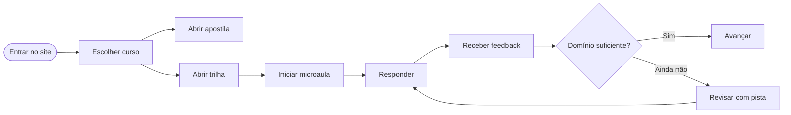
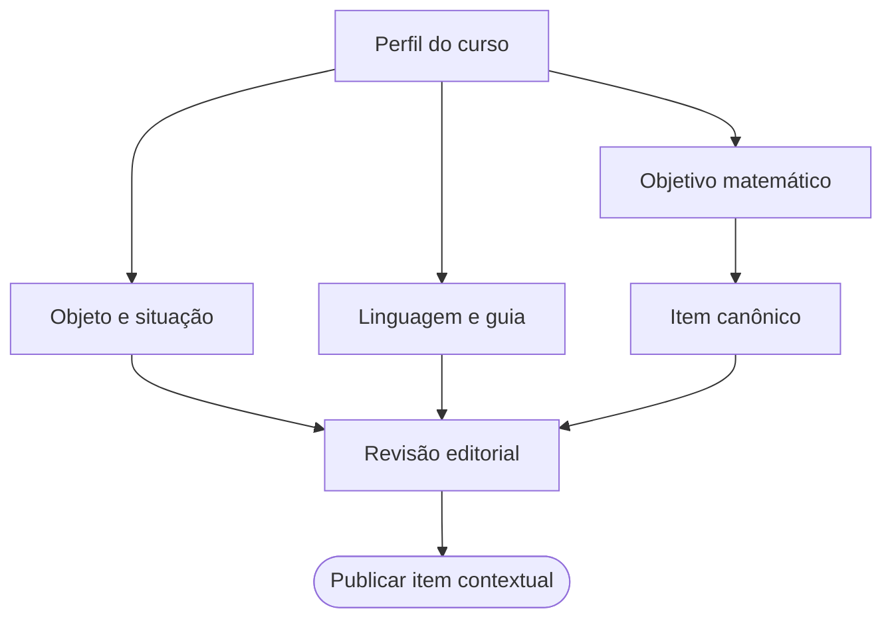
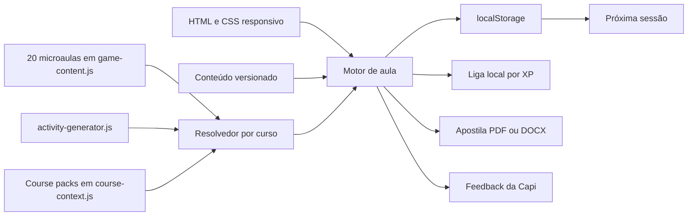

# CapyCalculus — arquitetura de produto, UX e game design

_Documento de produto para o protótipo responsivo MAT 146 — Cálculo I, versão 1.3, em 24/09/2026._

---

## 1. Escopo e visão do produto

**CapyCalculus** é um aplicativo web progressivo, instalável e responsivo para revisões de Cálculo I. O estudante escolhe um curso, acessa a apostila correspondente e entra em uma trilha de microaulas com exercícios derivados do conteúdo do próprio curso. **Capi**, uma capivara minimalista e original, atua como guia e mascote de feedback.

A experiência foi desenhada a partir do pacote local MAT 146, que registra quatro créditos, sessenta horas e cinco unidades: limites e continuidade; derivadas; aplicações da derivada; integrais; e aplicações da integral. [DADO CONFIRMADO — `../../README.md`, linhas 4–8] A personalização alcança onze cursos, cada um com apostila, questões contextualizadas e arquivos de apoio. [DADO CONFIRMADO — `../../README.md`, linhas 33–44] A seleção de curso não cria uma disciplina paralela: ela modifica objetos, linguagem, exemplos e transferência, enquanto o núcleo matemático permanece Cálculo I.

### Princípios de produto

| Princípio | Regra de projeto | Consequência prática |
| --- | --- | --- |
| Domínio antes de pontuação | Uma unidade abre após evidência de aprendizagem, não após abrir o app | Liga, tempo e XP não destravam conteúdo |
| Erro como informação | O erro indica o próximo passo e vira revisão | Não existe tela de humilhação ou “game over” |
| Contexto explícito | O cenário identifica o curso, mas os dados são rotulados como didáticos | Evita confundir modelo matemático com dado real |
| Curto e aprofundável | Uma primeira passagem leva poucos minutos; a apostila oferece aprofundamento | Resposta rápida não vira culpabilização por demorar |
| Acessibilidade por padrão | Toque, teclado, leitor de tela, contraste e movimento reduzido | Arraste nunca é a única forma de responder |
| Marca original | A linguagem visual é inspirada no microlearning, não uma cópia de terceiros | Mascote, nome, ícones e layout são próprios |

### Escopo do MVP

O MVP contém seleção dos onze cursos, acesso às apostilas em PDF, DOCX e HTML, trilha visual com vinte microaulas jogáveis, uma questão final contextual por microaula, atividades aleatórias completas nas etapas anteriores, links para o tópico correspondente da apostila, progressão de dificuldade, feedback contextual, reinício motivacional ao zerar os corações, liga local por XP, persistência local, tema claro/escuro e modo instalável. Backend, contas, placar remoto, Inteligência Artificial adaptativa, compras e envio de mensagens ficam fora da primeira entrega.

## 2. Arquitetura da experiência

### Journey principal



### Telas e responsabilidades

| Tela | Objetivo | Saída principal |
| --- | --- | --- |
| Início | Explicar a proposta e a chamada principal | Curso selecionado ou primeira microaula |
| Seletor de curso | Escolha explícita e busca | Perfil persistente do estudante |
| Painel | Reunir apostila, progresso e missão atual | Abrir material ou iniciar tarefa |
| Trilha | Mostrar dependências e progressão | Microaula disponível |
| Lição | Ensinar, praticar e explicar | Domínio, revisão ou nova tentativa |
| Liga | Ampliar socialização sem tornar competitivo o núcleo | Faixa e progresso semanal locais |
| Errata | Registrar padrões de erro | Revisão espaçada |
| Configurações | Acessibilidade, tema, dados e privacidade | Preferências locais |

### Estados de navegação

- Uma única página mantém a continuidade entre curso, apostila, trilha e jogo.
- O endereço da página pode ser recarregada sem apagar o progresso local.
- Todas as vinte microaulas estão acessíveis desde o início, e a Regra da Cadeia também é o exemplo de abertura contextual.
- Toda alteração relevante é anunciada em uma região `aria-live`, sem depender de cor ou som.

## 3. Trilha de aprendizagem

As unidades abaixo usam durações-alvo de três a cinco minutos. Essas sequências são hipóteses de produto e não evidência de eficácia. [ESTIMATIVA FUNDAMENTADA — configuração inicial]

### Visão geral

| Módulo | Foco | Unidades de microlearning |
| --- | --- | --- |
| 1. Pré-Cálculo e Funções | Ponte de entrada | Álgebra; funções; gráficos; composição e inversa |
| 2. Limites e Continuidade | Aproximação e comportamento formal | Ideia de limite; laterais; notáveis; continuidade |
| 3. Derivadas e Regras | Taxa e composição | Taxa instantânea; regras básicas; cadeia; funções especiais |
| 4. Aplicações da Derivada | Interpretação e decisão | Monotonicidade; curva; otimização e taxas; L’Hôpital |
| 5. Integrais e FTC | Acúmulo e mudança | Antiderivativa; substituição; integral definida; áreas e EDO |

### Módulo 1 — Pré-Cálculo e Funções Fundamentais

| Unidade | Microaula | Objetivo observável | Interação dominante |
| --- | --- | --- | --- |
| 1.1 | Álgebra que sustenta o Cálculo | Manipular frações, sinais e potências | Preenchimento de lacunas |
| 1.2 | Funções, domínio e imagem | Ler domínio, imagem e unidade funcional | Associação de pares |
| 1.3 | Gráficos e transformações | Relacionar expressão, gráfico e transformação | Clique no gráfico |
| 1.4 | Composição e funções inversas | Identificar entrada, saída e composição | Arraste e monte |

**Regra curricular:** este módulo é uma ponte de pré-requisitos e não uma sexta unidade do programa. Ele usa exemplos artificiais simples, como `f(x)=3x+2`, antes de qualquer contextualização quantitativa.

### Módulo 2 — Limites e Continuidade

| Unidade | Microaula | Objetivo observável | Interação dominante |
| --- | --- | --- | --- |
| 2.1 | A ideia intuitiva de limite | Descrever aproximação por gráficos e tabelas | Múltipla escolha conceitual |
| 2.2 | Limites laterais e existência | Comparar limites laterais | Encontre o erro |
| 2.3 | Limites notáveis e técnicas | Aplicar técnica e justificar hipótese | Arraste e monte |
| 2.4 | Continuidade e descontinuidades | Distinguir limite, valor e continuidade | Associação de pares |

### Módulo 3 — Derivadas e Regras de Derivação

| Unidade | Microaula | Objetivo observável | Interação dominante |
| --- | --- | --- | --- |
| 3.1 | Derivada como taxa de variação | Ler `f′(x)` como taxa local | Contexto do curso |
| 3.2 | Potência, soma, produto e quociente | Selecionar e justificar a regra | Preenchimento de lacunas |
| 3.3 | Regra da Cadeia | Decompor e multiplicar as camadas | Quatro mecânicas combinadas |
| 3.4 | Trigonométrica, exponencial e logaritmo | Identificar regra e composição | Associação e transferência |

### Módulo 4 — Aplicações da Derivada

| Unidade | Microaula | Objetivo observável | Interação dominante |
| --- | --- | --- | --- |
| 4.1 | Taxa de variação e monotonicidade | Relacionar sinal da derivada e crescimento | Múltipla escolha |
| 4.2 | Pontos críticos e traçado de curvas | Analisar um quadro de variação | Arraste e monte |
| 4.3 | Otimização e taxas relacionadas | Modelar, derivar e verificar unidade | Modelagem guiada |
| 4.4 | L’Hôpital e validação de modelos | Identificar hipóteses e coerência dimensional | Encontre o erro |

### Módulo 5 — Integrais e Teorema Fundamental do Cálculo

| Unidade | Microaula | Objetivo observável | Interação dominante |
| --- | --- | --- | --- |
| 5.1 | Integral como acúmulo | Interpretar área, taxa e unidade | Contexto do curso |
| 5.2 | Antiderivativas e substituição | Verificar derivada e trocar variável | Preenchimento de lacunas |
| 5.3 | Integral definida e FTC | Relacionar acumulação, área e antiderivativa | Associação |
| 5.4 | Áreas, unidades e EDO separável | Resolver e interpretar um acúmulo | Modelagem guiada |

### Inventário jogável

As vinte microaulas estão declaradas em `game-content.js`, com quatro unidades em cada módulo:

| Módulo | Microaulas |
| --- | --- |
| 1 | Álgebra que sustenta o Cálculo; Funções, domínio e imagem; Gráficos e transformações; Composição e funções inversas |
| 2 | A ideia intuitiva de limite; Limites laterais e existência; Limites notáveis e técnicas; Continuidade e descontinuidades |
| 3 | Derivada como taxa de variação; Potência, soma, produto e quociente; Regra da Cadeia; Trigonométrica, exponencial e logaritmo |
| 4 | Taxa de variação e monotonicidade; Pontos críticos e traçado de curvas; Otimização e taxas relacionadas; L’Hôpital e validação de modelos |
| 5 | Integral como acúmulo; Antiderivativas e substituição; Integral definida e FTC; Áreas, unidades e EDO separável |

Cada microaula tem uma explicação e três atividades; a Regra da Cadeia tem quatro atividades para preservar a demonstração completa. `course-context.js` fornece uma questão final contextual para cada uma das 20 microaulas de cada um dos 11 cursos, totalizando 220 questões finais. As atividades anteriores são geradas por `activity-generator.js`: são 41 atividades aleatórias por curso e sessão, preservando a sequência de tipos declaradas em `game-content.js`. Assim, uma sessão completa por curso tem 61 atividades renderizáveis e a matriz de 11 cursos tem 671 atividades, das quais 451 são variações aleatórias e 220 são finais contextuais. O resolvedor é obrigatório: se um pacote contextual faltar, a fase não abre com exemplos genéricos ou de outro curso. Todos os modelos e números são didáticos/fictícios e devem ser conferidos por docente antes de uso em turma. [DADO CONFIRMADO — inventário local de `game-content.js`, `activity-generator.js` e `course-context.js`]

### Regra de acesso e conclusão

No protótipo, as vinte microaulas ficam disponíveis desde o início para que cada curso possa experimentar a trilha completa. O estado visual distingue `disponível`, `concluída` e `revisitar`, mas não transforma uma sessão em avaliação de domínio. Uma microaula pode ser marcada como concluída ao terminar suas atividades; o sistema preserva o conteúdo, o contexto e o feedback recuperável. [ESTIMATIVA FUNDAMENTADA — regra de implementação]

Cada tentativa usa uma seed nova. A sequência de mecânicas e de habilidades permanece fixa, mas os valores, resultados e enunciados gerados antes da questão final mudam. A tela final é sempre a única atividade marcada como `contextResolved` e recebe a dificuldade `challenge`. Ao zerar os três corações, a atividade atual é reiniciada do início da lição, recebe uma nova seed e mostra uma mensagem motivacional antes de retornar à tela explicativa. [DADO CONFIRMADO — implementação local em `app.js` e `activity-generator.js`]

Nenhum erro remove conteúdo, impede a abertura de outra microaula ou reinicia a trilha. A alteração de curso preserva o progresso por identificador de fase e adapta os modelos contextuais.

## 4. Interações e feedback

### Catálogo de mecânicas

| Mecânica | Tradução para Cálculo I | Validação de resposta | Fallback acessível |
| --- | --- | --- | --- |
| Escolha conceitual | Gráfico, teorema, limite, função interna | ID de alternativa e justificativa | Tocar/clicar na opção |
| Arraste e monte | Demonstração, limite, derivada e integração | Ordem de cartões | Botões mover antes/depois |
| Encontre o erro | Cálculo com falha de regra, sinal ou unidade | Linha do erro + correção | Seleção de linha |
| Associação de pares | Função–derivada e função–gráfico | Pares exatos | Menus de seleção |
| Preenchimento de lacunas | Regra da Cadeia, substituição `u` | Equivalência canônica | Seleção de componente |
| Modelagem contextual | Interpretar e aplicar no curso | Resposta estruturada + unidade | Roteiro em etapas |

### Motor de prática

1. Selecionar a microaula e recuperar o curso ativo.
2. Gerar uma seed de tentativa e chamar `resolveCourseActivities(definition, course, seed)`.
3. Exigir um pacote correspondente em `course-context.js`; ausência de binding bloqueia a fase.
4. Exibir uma tela explicativa com objetivo, cenário, fórmula contextual e link para o tópico da apostila.
5. Renderizar de três a quatro atividades: as anteriores são geradas por `activity-generator.js` e a última é a questão contextual do curso.
6. Resolver a atividade por rádio, seleção de lacuna, ordem de passos ou associação de pares.
7. Registrar primeira tentativa, erro, pista e conclusão no estado local.
8. Fornecer feedback específico; ao zerar os corações, exibir mensagem motivacional e reiniciar a lição com nova seed.
9. Registrar a microaula em `completed` e atualizar XP, liga local e resumo da trilha.

A implementação atual é determinística e local. Não há modelo adaptativo, servidor, telemetria ou escore de domínio.

### Conteúdo da resposta

`game-content.js` mantém o contrato matemático e a sequência de mecânicas de cada microaula; `activity-generator.js` altera valores, resultados e enunciados das atividades não finais; `course-context.js` é a fonte autoritativa do cenário e da única questão final contextual por microaula. Cada microaula contém `id`, `moduleId`, `title`, `duration`, `objective`, `explanation` e `activities`. As atividades geradas acrescentam `generated`, `attemptSeed`, `dataStatus: generated-didactic` e `sourceRef`; a questão final acrescenta `courseSlug`, `contextLabel`, `contextModel`, `contextPoint`, `contextValue`, `contextResolved`, `dataStatus: fictitious` e `sourceRef`. Os campos `options`, `fields`, `items` ou `pairs` variam conforme o formato. Respostas abertas não são pontuadas automaticamente nesta versão.

### Feedback da Capi

**Acerto**

- “Boa! O caminho matemático ficou claro.”
- “Isso! A corrente foi derivada por completo.”
- “Mandou bem — seu raciocínio está ganhando ritmo.”

**Erro recuperável**

- “Quase! A Capivara sugere olhar a função interna.”
- “Ainda não — revise onde a variável externa muda.”
- “Não tem problema. Tente mais uma vez sem perder XP.”

**Sequência**

- “A sequência ficou forte! A Capivara GP está acordada.”
- “Sua consistência virou ritmo matemático.”

O erro nunca recebe a mensagem “fracassou” ou uma imagem de raiva. As expressões existentes de raiva ficam reservadas para correções de estilo futuras e não devem representar a resposta do estudante.

## 5. Personalização por curso

O seletor troca cinco camadas: apostila, guia, contexto, exercício e enunciado. O mesmo modelo matemático pode aparecer em objetos diferentes, mas a forma da questão continua sendo revisada para evitar repetição superficial. O seletor resolve a questão final inteira a partir de `course-context.js` e deixa as atividades anteriores para o gerador aleatório; não basta prefixar o nome do curso a um exemplo fixo. As funções e números desta tabela foram extraídos ou reconstruídos a partir das apostilas locais e são modelos didáticos com valores fictícios. [DADO CONFIRMADO — arquivos `../../<curso>/05_APOSTILA_ACESSIVEL.md` e inventário local]

| Curso | Guia | Contexto da Regra da Cadeia |
| --- | --- | --- |
| Administração | Marina | `V(t)=(0,2t²+5)³`, `V′(t)=1,2t(0,2t²+5)²` |
| Agronegócio | Seu Tonho | `H(t)=(0,2t²+8)³`, `H′(t)=1,2t(0,2t²+8)²` |
| Agronomia | Zé | `V(t)=(2t+1)³`, `V′(t)=6(2t+1)²` |
| Arquitetura e Urbanismo | Lina | `L(x)=100/(0,5x+1)²`, `L′(x)=−100/(0,5x+1)³` |
| Ciência e Tecnologia de Laticínios | Dona Cida | `T(t)=22+48e^(−0,15t)`, `T′(t)=−7,2e^(−0,15t)` |
| Ciências Biológicas — Bacharelado | Bia | `M(t)=200e^(−0,05t)`, `M′(t)=−10e^(−0,05t)` |
| Ciências Biológicas — Licenciatura | Prof. Bio | `M(t)=200e^(−0,05t)`, `M′(t)=−10e^(−0,05t)` |
| Ciências Contábeis | Contador Paulo | `D(x)=(5x²−3)⁴`, `D′(x)=40x(5x²−3)³` |
| Cooperativismo | Assembleia da cooperativa | `P(t)=(0,2t²+10)⁴`, `P′(t)=1,6t(0,2t²+10)³` |
| Engenharia Florestal | Guarda Rafa | `A(d)=0,00007854d²`, `d=2t+10`, `dA/dt=0,00031416(2t+10)` |
| Zootecnia | Vaquera Ana | `C(t)=(0,5t²+4)³`, `C′(t)=3t(0,5t²+4)²` |

### Contrato de conteúdo por curso



### Regras editoriais

- Contexto não altera a resposta matemática; ele cria a situação, as unidades e a pergunta.
- A questão final só é publicada para o curso quando `courseSlug`, `contextLabel` e `sourceRef` estão presentes; não há fallback para um exemplo de outro curso.
- As atividades anteriores só podem ser publicadas quando possuem prompt completo, opções/campos/itens/pares válidos, `generated: true` e `dataStatus: generated-didactic`.
- Números de campo, temperaturas, custos, recomendações agronômicas, regimes contábeis e dados biológicos permanecem marcados como didáticos.
- O produto não usa tabelas da apostila como base empírica.
- Dados governamentais só entram após fonte oficial e validação separada.
- Perguntas abertas a partir de uma resposta canônica exigem `reviewStatus: human-review`.

### Colisões de nomes

- “Dona Cida” identifica a protagonista de Laticínios e também aparece na narrativa de Cooperativismo; o perfil deve manter o papel de cada uma.
- “Paulo” é o contador de Ciências Contábeis e também um personagem secundário de Cooperativismo.
- “Ana” é a protagonista de Zootecnia e uma cooperada em outro material.
- “Bia” e “Prof. Bio” pertencem a cursos diferentes, embora usem contexto biológico semelhante.

## 6. Gamificação e retenção

Todos os números desta seção são configurações iniciais de produto, não resultados de eficácia. [ESTIMATIVA FUNDAMENTADA]

### Corações ou vidas

O checkpoint inicia com três corações. Um erro sem pista consome um coração. Pistas, acessibilidade, tempo adicional, revisão e reprodução não consomem corações. Ao chegar a zero, a atividade exibe uma mensagem motivacional, reinicia do início com nova seed e restaura três corações; não há game over. A mensagem fica disponível por um breve intervalo antes do reinício.

A opção “sem corações” deve existir para diagnóstico, avaliação e estudantes que preferem fluxo contínuo. A nota nunca depende de corações, XP, liga ou streak.

### XP e economia

| Evento | XP sugerido | Regra |
| --- | ---: | --- |
| Microaula concluída | 20–28 | `20 + 2 × acertos de primeira tentativa`; uma microaula tem três ou quatro atividades |
| Repetição | 0 | Não remove progresso; a sessão pode ser reexecutada sem repetir a recompensa |
| Pista | 0 | Registrada como apoio, nunca como penalidade |
| Bônus de consistência | 5–10 | Uma vez por marco semanal |
| Missão contextual do curso | 20 | Depende de justificativa em versão docente futura |

Itens podem usar moedas internas, chamadas de “Caps”, somente para pistas ou revisões internas da equipe. Não há compra com dinheiro real, sorteio aleatório, aposta ou barreira pagante para o conteúdo matemático.

### Ofensiva ou streak

Um dia conta quando há microaula, revisão significativa ou desafio. Apenas abrir o app não conta. Uma tolerância semanal pode congelar a sequência; o congelador não aumenta XP. A sequência não bloqueia conteúdo e não cria multiplicador de nota. Marcos de três, sete e catorze dias geram apenas reconhecimento visual. [ESTIMATIVA FUNDAMENTADA]

### Ligas

A liga local usa um recorte semanal e cinco faixas:

| Faixa | XP acumulado | Nome |
| --- | ---: | --- |
| 1 | 0 | Liga de Cauchy |
| 2 | 200 | Liga de Leibniz |
| 3 | 500 | Liga de Newton |
| 4 | 1000 | Liga de Lagrange |
| 5 | 1750 | Liga de Euler |

A implementação atual calcula a faixa, o progresso para a próxima, o melhor XP semanal e o número de microaulas concluídas. O progresso é salvo no navegador; repetição de uma microaula já concluída não soma XP nem altera a contagem semanal. Não há competidores fictícios, placar remoto ou transferência de dados. [DADO CONFIRMADO — `leagueTiers` e `normalizeLeague` em `app.js`]

### Desafios semanais

- “Caçador de extremos”: escolher entre funções lineares, quadráticas e racionais.
- “Unidades que contam”: identificar a unidade de uma taxa de variação.
- “Cadeia em contexto”: derivar o modelo fictício do curso.
- “Erro silencioso”: localizar uma falha em um cálculo.
- “Sua vez”: escrever um modelo, sua variável independente e sua unidade.

Títulos e regras são propostas de design. O balanceamento deve ser definido com teste docente e revisado para evitar cansaço. [ESTIMATIVA FUNDAMENTADA]

## 7. UX, responsividade e acessibilidade

### Breakpoints de projeto

| Faixa | Largura de referência | Comportamento |
| --- | ---: | --- |
| Celular | 320–767 px | Uma coluna, ações fixas, opções grandes |
| Tablet | 768–1023 px | Duas colunas onde há espaço |
| Desktop | 1024–1439 px | Painel, trilha e jogo lado a lado |
| Amplo/projetor | 1440 px ou mais | Contexto visual e modo sala |

Os valores são referências de implementação, não capacidades universais. [ESTIMATIVA FUNDAMENTADA] O protótipo evita rolagem horizontal, transforma a trilha em pilha, move o guia da Capi para uma área compacta e mantém as ações ao alcance do polegar.

### Acessibilidade

- Alvos de toque com pelo menos quarenta e quatro pixels nas ações principais. [ESTIMATIVA FUNDAMENTADA — referência de interface]
- Foco visível, ordem de tabulação previsível e operação completa por teclado.
- `fieldset`, `legend`, `label`, `aria-live`, regiões de diálogo e foco devolvido ao fechar.
- Arraste possui alternativa por botão e seleção.
- Erro usa texto, símbolo e cor; nunca apenas cor.
- Gráfico possui descrição, pontos e alternativa textual.
- Fórmulas possuem representação em texto legível e versão MathML em evolução.
- Cronômetro é opcional, pausável e desativável.
- `prefers-reduced-motion` remove animação e transição.
- Tema escuro e contraste reforçado mantêm a mesma hierarquia.

### Localização do erro

O produto separa `base`, `conceito`, `regra`, `sinal`, `unidade` e `descuido`. O estudante pode abrir a errata, revisar uma microaula e tentar novamente. O relatório docente mostra distribuição de tags, não nome completo nem dado sensível em uma tela pública.

## 8. Arquitetura técnica e dados

### Camadas



O MVP usa HTML, CSS e JavaScript sem framework, para abrir diretamente no navegador e manter dependências mínimas. O service worker armazena somente o shell do aplicativo; PDFs e DOCX não entram no cache automático.

### Arquivos entregues

| Arquivo | Responsabilidade |
| --- | --- |
| `index.html` | Shell semântico, seleção de curso, painel, trilha e diálogo do jogo |
| `styles.css` | Design system, temas, breakpoints e estados de foco |
| `data.js` | Cursos, unidades, mecânicas e mensagens da Capi |
| `game-content.js` | Catálogo versionado das vinte microaulas e atividades-base |
| `activity-generator.js` | Gerador pseudoaleatório determinístico para atividades não finais, com seed e valores didáticos |
| `course-context.js` | Pacotes dos onze cursos e resolução fail-closed da questão final de cada microaula |
| `app.js` | Estado, persistência, navegação, validação, reinício motivacional, liga local e renderização das atividades |
| `manifest.webmanifest` | Instalação como aplicativo |
| `sw.js` | Cache do shell e funcionamento offline |
| `assets/mascote/` | Oito sprites canônicos com transparência |
| `assets/capas/` | Capa de cada curso |
| `biblioteca/` | Apostilas, questões contextualizadas e README autocontidos |
| `assets/illustrations/` | Arte contextual da Regra da Cadeia |
| `assets/scenarios/` | Cinco cenários para os módulos |
| `assets/badges/` | Doze conquistas e medalhas |
| `tests/smoke.test.js` | Integridade de dados e arquivos principais |

### Executar localmente

Abra `index.html` diretamente para usar a versão sem instalação. Para habilitar service worker e testar a instalação, execute a partir da raiz do pacote:

```bash
python -m http.server 8000 --directory site
```

Acesse `http://localhost:8000`. Os documentos das apostilas, as questões contextualizadas, as capas e o README estão internalizados no site; portanto, os links funcionam mesmo quando a raiz do servidor é a própria pasta `site/`.

### Modelo persistido

```json
{
  "selectedCourse": "agronomia",
  "xp": 30,
  "streak": 1,
  "lastActiveDate": "2026-09-24",
  "hearts": 3,
  "completed": ["m1-1", "m1-2", "m3-3"],
  "demoCompleted": ["m3-3"],
  "league": {
    "weekKey": "2026-09-21",
    "weeklyXp": 30,
    "bestWeeklyXp": 30,
    "completedThisWeek": 1
  },
  "theme": "light"
}
```

O exemplo acima representa o formato, não o perfil de uma pessoa real. Um perfil completo pode acrescentar `mastery`, `mistakes`, `reviewSchedule`, `settings` e `contentVersion`.

### Eventos de domínio

- `course_selected`
- `lesson_started`
- `answer_submitted`
- `hint_requested`
- `error_classified`
- `lesson_completed`
- `review_completed`
- `apostila_opened`

Eventos devem ser anonimizados, minimizados e submetidos a revisão de privacidade antes de qualquer telemetria. O protótipo não transmite dados de aprendizagem.

### Evolução futura

- IndexedDB para histórico e itens offline
- serviço de equivalência simbólica com AST, não comparação de texto
- MathML e notação de voz
- backend opcional para turmas e painel docente
- CMS com revisão, versionamento e publicação por curso
- modelos adaptativos auditados e offline fallback determinístico

## 9. Exemplo de implementação — Regra da Cadeia

A Regra da Cadeia é a microaula `m3-3` e continua sendo o exemplo de referência. O protótipo usa `V(t)=(2t+1)³` quando o curso selecionado é Agronomia. A estrutura não muda quando outro curso é escolhido: apenas o modelo, as unidades e a explicação contextual se adaptam. Os valores e a fórmula deste roteiro foram extraídos da apostila local de Agronomia. [DADO CONFIRMADO — `../../agronomia/05_APOSTILA_ACESSIVEL.md`]

O arquivo `game-content.js` também declara as outras dezesseis microaulas. `course-context.js` fornece o pacote do curso selecionado para a questão final de cada uma; `activity-generator.js` cria as atividades anteriores com valores diferentes a cada tentativa. A Regra da Cadeia é apenas o exemplo de referência de um contrato comum: todas as microaulas usam a mesma tela explicativa, sequência de atividades, feedback, contexto do curso e conclusão.

### Tela 1 — Explicação visual

**Frase:** “A corrente tem duas etapas: derivamos a parte de fora e multiplicamos pela parte de dentro.”

```mermaid
flowchart LR
    accTitle: Regra da Cadeia em Três Passos
    accDescr: A função interna recebe a variável, a função externa recebe o resultado e a derivada final multiplica as duas camadas.

    variable([t]) --> inner[u = 2t + 1]
    inner --> outer[V = u³]
    outer --> product[V′ = 3u² · 2]
    product --> result([6(2t + 1)²])
```

A tela usa apenas uma frase, o diagrama e a fórmula contextual. A Capi pergunta “Qual função está por dentro?” e permite seguir sem depender de áudio.

### Tela 2 — Escolha conceitual

**Pergunta:** No modelo `V(t)=(2t+1)³`, qual expressão é a função interna?

| Opção | Resposta |
| --- | --- |
| A | `u=2t+1` — correta |
| B | `V=u³` |
| C | `V′=6(2t+1)²` |
| D | A função inteira é interna |

**Feedback correto:** “A função interna é `u=2t+1`; a externa recebe esse resultado.”

**Feedback de retomada:** “Quase! Observe o trecho que ainda contém `t`.”

### Tela 3 — Preenchimento de lacunas

**Tarefa:** completar `V′(t) = [externa] × [interna] = [resultado]`.

| Lacuna | Resposta |
| --- | --- |
| Derivada de `u³` | `3u²` |
| Derivada de `2t+1` | `2` |
| Resultado | `6(2t+1)²` |

**Feedback correto:** “A corrente correta é `3u² × 2 = 6(2t+1)²`.”

**Fallback:** o aluno pode abrir as camadas separadamente ou receber a estrutura `externo × interno`.

### Tela 4 — Encontre o erro

**Tentativa:**

```text
1. Defina u = 2t + 1.
2. Reescreva V = u³.
3. Use apenas V′ = 3u².
4. Conclua a conta final.
```

**Pergunta:** em qual linha a corrente foi perdida?

- **Resposta:** linha 3.
- **Correção:** `V′ = 3u² · u′ = 3u² · 2`.
- **Classificação:** regra, não descuido.

**Feedback de retomada:** “A linha 3 derivou a externa, mas não multiplicou por `u′`.”

### Tela 5 — Associação de pares

| Função | Derivada correta |
| --- | --- |
| `V(t)=(2t+1)³` | `V′(t)=6(2t+1)²` |
| `f(x)=sin(x)` | `f′(x)=cos(x)` |
| `g(x)=eˣ` | `g′(x)=eˣ` |

**Feedback correto:** “No contexto de Agronomia, a corrente termina em `6(2t+1)²`.”

### Tela de conclusão

O protótipo calcula o resultado real da sessão:

- `20 + 2 × acertos de primeira tentativa`, entre vinte e vinte e oito XP; [ESTIMATIVA FUNDAMENTADA — regra inicial]
- tempo decorrido em minutos e segundos;
- percentual de acerto na primeira tentativa entre quatro exercícios;
- número de erros e pistas;
- mensagem da Capi conforme desempenho;
- recomendação de repetir a mesma estrutura em outro contexto.

Após a conclusão, a trilha marca a microaula como concluída e permite revisitar a qualquer momento. A `m3-3` também permanece registrada no campo legado `demoCompleted` para preservar compatibilidade com estados anteriores. Isso preserva a diferença entre conclusão de protótipo e domínio avaliado.

## 10. Implementação, QA e ativos

### Estado do protótipo

- _site entregue_: seleção dos onze cursos, apostilas HTML/PDF/DOCX com navegação por cinco tópicos, vinte microaulas, cinco cenários, oito sprites, doze medalhas, tema, progresso local, gerador aleatório, personalização final, links para a apostila, reinício motivacional ao zerar corações e liga local.
- _conteúdo jogável_: `game-content.js` contém 20 microaulas e 61 atividades-base; `activity-generator.js` resolve 451 atividades aleatórias por sessão completa dos 11 cursos e `course-context.js` resolve 220 questões finais contextuais, totalizando 671 atividades renderizáveis na matriz. [DADO CONFIRMADO — inventário local]
- _validação automática_: smoke 19/19, resolução do conjunto 671/671, DOM/E2E 40/40, matriz 1793/1793, Axe/JSDOM 0 violações automáticas nos estados testados, teste específico de perda de corações aprovado, HTTP 134/134 arquivos do pacote e CSS 670 + 170 regras sem erro. [DADO CONFIRMADO — inventário local]
- _auditoria do gerador_: 1.000 seeds por curso/lição sem placeholders, alternativas duplicadas ou fallbacks `"valor auxiliar"`; pares e fórmulas conhecidos foram corrigidos e cobertos por amostras de smoke. [DADO CONFIRMADO — auditoria local]
- _documento PDF_: `GAME_DESIGN.pdf` regenerado com 25 páginas e texto extraível. [DADO CONFIRMADO — local PDF]
- _validação pendente_: revisão matemática e didática humana, teste em aparelho real e teste com turma.

### Cobertura quantitativa do inventário

- 5 módulos e 20 microaulas.
- 19 microaulas com 3 atividades e 1 microaula com 4 atividades.
- 61 atividades-base no total: 40 de escolha ou erro, 6 de preenchimento, 10 de ordem e 5 de associação de pares. [DADO CONFIRMADO — contagem local em `game-content.js`]
- 220 questões finais contextuais: uma por microaula e curso; todas carregam `courseSlug`, `contextLabel`, `dataStatus` e `sourceRef`. [DADO CONFIRMADO — matriz de resolução]
- 451 atividades aleatórias: duas por microaula de três atividades e três na microaula de quatro atividades, para cada curso; todas carregam `generated`, `attemptSeed`, `dataStatus: generated-didactic` e `sourceRef`. [DADO CONFIRMADO — matriz de resolução]
- 11 perfis de curso, com fórmula, derivada, função interna, função externa e contexto próprios.
- 55 links de navegação de tópicos: cinco em cada uma das 11 apostilas HTML.
- Uma sequência de dificuldade por tentativa: `easy`, `medium`, `hard` e `challenge` para a questão final.

### Plano de QA

| Área | Verificação |
| --- | --- |
| Matemática | Gabarito, equivalência, sinal, unidade e exemplos contextuais; revisão humana pendente |
| Troca de curso | Apostila, capa, guia e questão final mudam juntos; 671/671 atividades do conjunto resolvidas sem vazamento de outro curso |
| Trilha | 20/20 microaulas abrem, respondem e registram conclusão; smoke de conteúdo |
| Aleatoriedade | Duas tentativas da mesma lição preservam a sequência, mas mudam valores e resultados antes da questão final |
| Corações | Três erros exibem mensagem motivacional, reiniciam a lição e restauram três corações |
| Navegação | 55/55 links de cinco tópicos resolvem para IDs existentes; o jogo abre a âncora do módulo |
| Liga | XP semanal, faixa, progresso, melhor semana e cinco níveis persistem localmente sem competidores fictícios |
| Responsividade | 320, 375, 768, 1024 e 1440 px |
| Teclado | Todos os controles e diálogos |
| Leitor de tela | Nome, papel, estado, foco e anúncio de feedback; Axe/JSDOM |
| Persistência | Recarregar, trocar curso, limpar dados e reinstalar |
| Offline | Shell, mascotes, seleção e aula sem rede |
| Contraste | Temas claro, escuro e foco visível |
| Movimento | `prefers-reduced-motion` sem perda de função |
| Integridade | Nenhum modelo contextual apresentado como dado real |

### Ativos recebidos e prompts de origem

A pasta `../../mascote jogo/` contém seis JPEG: duas referências iniciais e quatro composições geradas a partir dos prompts deste documento. [DADO CONFIRMADO — inventário local] O pipeline removeu o quadriculado incorporado nos JPEG, recortou os arquivos e produziu:

- oito sprites de Capi com fundo transparente;
- uma arte contextual da Regra da Cadeia;
- cinco cenários, um por módulo;
- doze badges e medalhas;
- ícones PWA atualizados a partir do sprite neutro.

A prancha de sprites passa a ser a referência canônica da personagem no protótipo. A arte da Regra da Cadeia funciona como ilustração contextual; a antiga prancha de seis expressões permanece apenas como material de origem. Os prompts abaixo são preservados para permitir uma nova rodada vetorial caso o docente queira mais poses.

**Prompt 1 — sprite mestre da Capi (recebido e processado)**

> Create an original minimal 3D-vector capybara mascot sprite sheet named Capi, matching the provided reference exactly in body proportions, warm brown fur, cream muzzle and belly, orange nose and feet, large dark eyes, rounded shapes, and friendly calm personality. Keep the character completely original and do not imitate any existing language-learning mascot. Show eight transparent-background full-body poses: neutral, thinking, hint, happy, celebrate, encourage, review, and focus. Consistent camera, scale, lighting, outline weight, eye design, and palette across every pose. No text, no props, no logo, no shadows baked into transparency, no gradients outside the character, 4×2 grid, generous spacing, production-ready game assets.

**Prompt 2 — mascote da Regra da Cadeia (recebido e processado)**

> Create a transparent-background game illustration featuring the same Capi capybara guiding two connected mathematical layers: a small inner function tile flowing into an outer function tile, with two clean multiplication arrows suggesting the chain rule. Minimal original 3D-vector EdTech style, green, cream, orange and blue palette, no text, no numbers, no copyrighted symbols, no Duolingo owl, no resemblance to other mascots. Center composition, safe margins, high contrast, suitable for a 1024×768 game panel.

**Prompt 3 — cenários dos módulos (recebido e processado)**

> Produce five original minimal 3D-vector EdTech background scenes for CapiCalculus, each in a 16:9 landscape composition with large safe negative space for interface cards: pre-calculus with algebra blocks and function curves; limits with a path approaching a point; derivatives with a curve and tangent line; derivative applications with an optimization bridge; integrals with accumulating area tiles. Use the same warm green, cream, orange and blue system, soft depth, clean shapes, no text, no logos, no copyrighted characters, no busy details. Export each as a separate transparent or softly tinted background asset.

**Prompt 4 — badges e ligas (recebido e processado)**

> Create a cohesive set of twelve original flat-vector achievement badges for a university calculus game: function explorer, limit tracker, chain-rule current, derivative architect, integral accumulator, Newton league, Leibniz league, Lagrange league, Cauchy league, Euler league, weekly optimizer, and review rescuer. Minimal geometric symbols, original capybara-inspired color accents, high contrast, no text inside badges, transparent background, consistent stroke and spacing, accessible at 48 pixels.

### Entregas e critérios de saída

1. **MVP:** uma trilha completa de Cálculo I com 20 microaulas, troca de curso, apostilas navegáveis, cinco mecânicas, uma questão final contextual, atividades aleatórias, reinício motivacional e liga local.
2. **Beta:** primeira versão de domínio adaptativo, errata, revisão docente e testes com estudantes.
3. **Produção:** CMS docente, painel de turma, privacidade revisada, conteúdo integralmente revisado e suporte a instalação.
4. **Publicação:** revisão matemática humana, Declaração de Uso de IA, validação de acessibilidade e teste em diferentes aparelhos.

### Limitações e responsabilidade

O protótipo não comprova aprendizagem, não substitui avaliação docente e não usa dados reais de estudantes. Modelos contextualizados são exemplos matemáticos. O design instrucional e a implementação final devem ser validados por professor e equipe técnica antes de uso em turma.

### Fontes locais principais

- `../../README.md`
- `../../00_geral/01_PLANO_DE_ENSINO.md`
- `../../00_geral/04_SISTEMA_GAMIFICACAO.md`
- `../../00_geral/06_BANCO_QUESTOES_NUCLEO.md`
- `../../<curso>/05_APOSTILA_ACESSIVEL.md`
- `../../<curso>/03_QUESTOES_CONTEXTUALIZADAS.md`
- `../../jogo/05_QUIZ_DISPLAY.html`
- `../../mascote jogo/`

_Última atualização: 24/09/2026 · Protótipo CapyCalculus v1.3_
